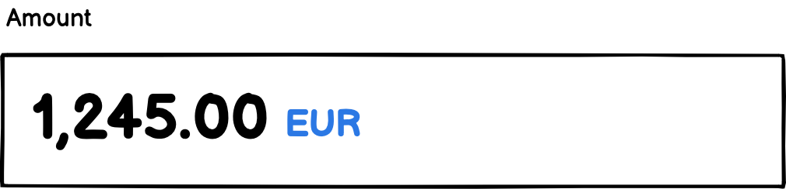
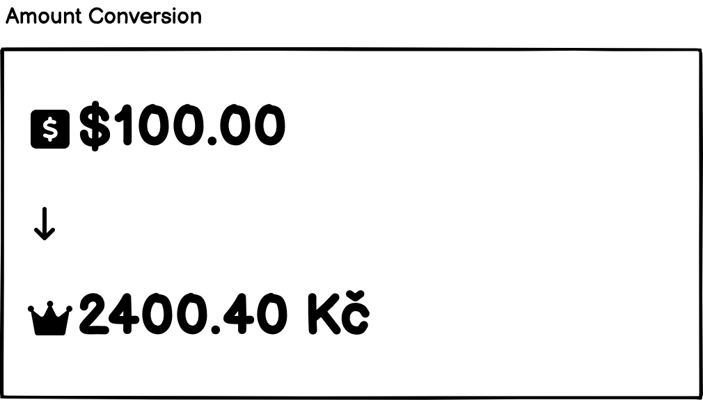
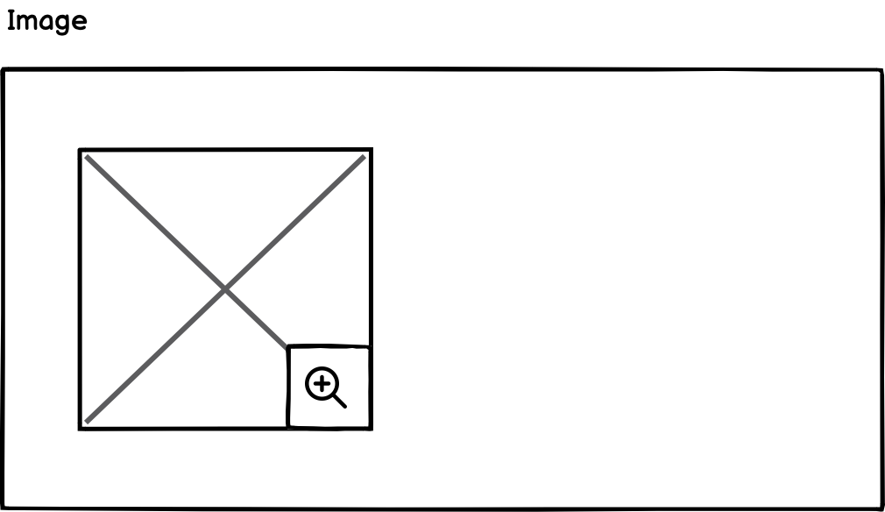
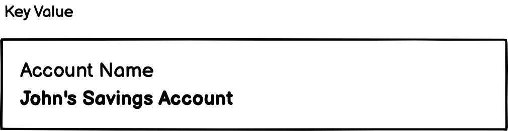
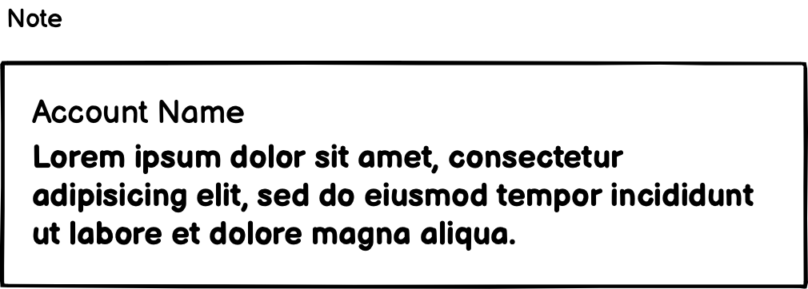
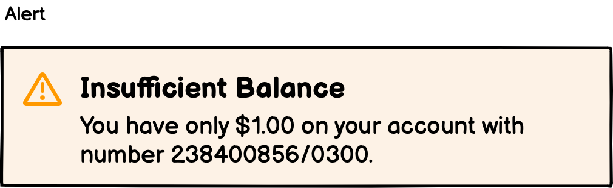
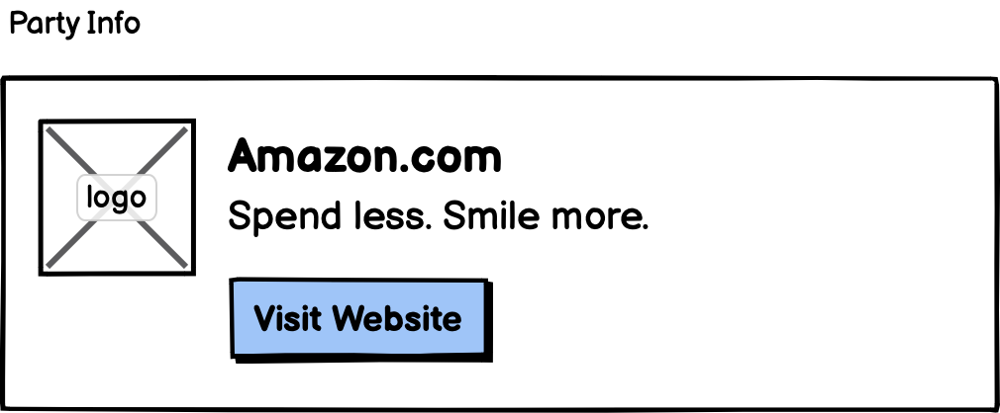

# Customizing Operation Form Data

When creating an operation, you can customize the operation form data. This customization has an effect on how the operation form data is displayed in the Mobile Token application.

## Standard Operation Form Data Attributes

Following attributes are required to be specified for each operation:

- `title` - title of the operation
- `message` - message for the user related to the operation

## Custom Operation Form Data Attributes

Following structured custom form data attributes are available:

- `AMOUNT` - amount with currency
- `AMOUNT_CONVERSION` - source and target amount with currency
- `IMAGE` external image with a thumbnail
- `NOTE` - free text
- `KEY_VALUE` - generic key-value field
- `HEADING` - heading with label 
- `ALERT` - alert with various alert types
- `PARTY_INFO` - information about party

## Value Formatting

Following form data attributes support value formatting:

- `AMOUNT`
- `AMOUNT_CONVERSION`

The value is formatted based on specified format type. The following format types can be used:

- `AMOUNT` - value is formatted as amount with currency using current locale
- `AMOUNT_CONVERSION` - value is formatted as amount with currency using current locale

### Operation Form Data JSON

You may specify operation template attributes to be used for the creation of operations.
The attribute `params` specifies keys to retrieve values from the operation details parameters.

This snippet configure 

#### AMOUNT



```json
{
  "id": "operation.amount",
  "type": "AMOUNT",
  "text": "Amount",
  "params": {
    "amount": "amount-key-may-be-changed",
    "currency": "currency-key-may-be-changed"
  }
}
```

Remarks:
- Always use `AMOUNT` as `type`
- The `amount` value can use decimal point
- Use ISO 4217 format of `currency`, the value is also provided in localized form.

#### AMOUNT_CONVERSION



```json
{
  "id": "operation.amountConversion",
  "type": "AMOUNT_CONVERSION",
  "text": "Amount Conversion",
  "params": {
    "dynamic": "dynamic-key-may-be-changed",
    "sourceAmount": "sourceAmount-key-may-be-changed",
    "sourceCurrency": "sourceCurrency-key-may-be-changed",
    "targetAmount": "targetAmount-key-may-be-changed",
    "targetCurrency": "targetCurrency-key-may-be-changed"
  }
}
```

Remarks:
- Always use `AMOUNT_CONVERSION` as `type`
- The `sourceAmount` and `targetAmount` values can use decimal point
- Use ISO 4217 format of `sourceCurrency` and `targetCurrency`, the values are also provided in localized form

#### IMAGE



```json
{
  "id": "operation.image",
  "type": "IMAGE",
  "text": "Image",
  "params": {
    "thumbnailUrl": "thumbnailUrl-key-may-be-changed",
    "originalUrl": "originalUrl-key-may-be-changed"
  }
}
```

Remarks:
- Always use `IMAGE` as `type`
- The `thumbnailUrl` is a URL to the thumbnail, the image in lower resolution
- The `originalUrl` is a URL to the original image in higher resolution

#### KEY_VALUE



```json
{
  "id": "operation.account",
  "type": "KEY_VALUE",
  "text": "To Account",
  "params": {
    "value": "value-key-may-be-changed"
  }
}
```

Remarks:
- Always use `KEY_VALUE` as `type`

#### NOTE



```json
{
  "id": "operation.note",
  "type": "NOTE",
  "text": "Note",
  "params": {
    "note": "note-key-may-be-changed"
  }
}
```

Remarks:
- Always use `NOTE` as `type`

#### HEADING


```json
{
  "id": "operation.heading",
  "type": "HEADING",
  "text": "Heading"
}
```

Remarks:
- Always use `HEADING` as `type`

#### ALERT



```json
{
  "id": "operation.alert",
  "type": "ALERT",
  "text": "Balance alert",
  "params": {
    "type": "alert-type-key-may-be-changed",
    "title": "title-key-may-be-changed",
    "message": "message-key-may-be-changed"
  }
}
```

Remarks:
- Always use `ALERT` as `type`
- Alert type can be any of `SUCCESS`, `INFO`, `WARNING` and `ERROR`
- The recommended formatting on the client side is the following:
  - Each alert type should have an associated icon to it.
  - If only message is specified, it is displayed as a regular text.
  - If both message and title are specified, title is displayed as a highlighted part of the text (i.e., bold and above the value), message as the regular text.
  - The element text present in the label value can be used for accessibility description of the cell or icon.

#### PARTY_INFO



```json
{
  "id": "operation.partyInfo",
  "type": "PARTY_INFO",
  "text": "Party Info",
  "params": {
    "logoUrl": "partyLogoUrl-key-may-be-changed",
    "name": "partyName-key-may-be-changed",
    "description": "partyDescription-key-may-be-changed",
    "websiteUrl": "partyUrl-key-may-be-changed"
  }
}
```

Remarks:
- Always use `PARTY_INFO` as `type`
