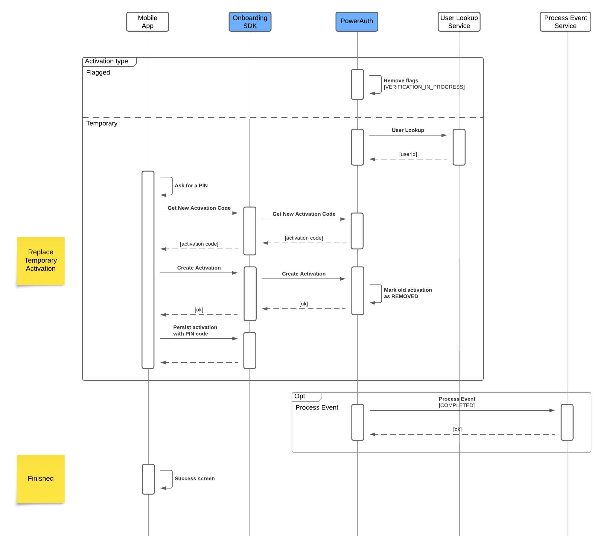

# Integration

## Identification

**1. Intro page + Collect User Data + AML/KYC form**
Described in [User Journeys](./User-Journeys.md) section.

**2. Process Configuration**
Call the SDK to retrieve the process configuration, which is a list of the available process types configured on the server, and select the one you need.

Read more about [Process Configuration](./Configuration#process-configuration).

**3. Process Start**
Initialize onboarding process with `process_type` and user `credentials`.

The process types should be selected from the previous step.

Credentials link the user's identity to the identity in the bank. For a new user, you can use an ID from your CRM system or a username and date of birth for recovery.

The system will start the new process with a new process ID.

**4. User Lookup**
There is a semi-mandatory step: calling the external [User Lookup Service](./External-Onboarding-Services.md#post-userlookup) to get user information based on the provided credentials. The service should return the user ID and indicate whether the consent page is required.

If you don't need consents, you have the option of calling this service later. In this case, the system will temporarily use the process ID to identify the user, so the activation will be temporary.

**5. Send OTP**
The OTP sent to the user will use the [OTP Delivery Service](./External-Onboarding-Services.md#post-otpsend).

**6. Enter OTP + Create Activation**
The user enters the OTP, and the activation can be created using the provided code.

**7. PIN/Biometry setup**
To complete the device activation, the user must set up a PIN and allow the use of biometrics.

## Identity Verification

**Steps**

**1. Get Consent Text**
If consents are enabled, the SDK provides the text of the consent. The system must be configured with the [Consent Text Service](./External-Onboarding-Services.md#post-consenttext) on the backend. This service must be configured if the [User Lookup Service](./External-Onboarding-Services.md#post-userlookup) returns the consent as required.

**2. Approve Consent + Consent Approve**
The user approves the displayed consent, and the event propagates via the SDK to the backend. The backend marks the consent as approved and, if configured, propagates the information via the [Consent Storage Service](./External-Onboarding-Services#post-consentstorage).

**3. Set Document Types**
The user selects the document types required for verification. The SDK receives information about the selected document types.

**4. Scan Documents**
The user scans documents one by one, using the partner's BlinkID SDK to scan both sides of the document if required.

**5. Submit documents**
Documents are submitted to the backend in bulk, where they are verified against the partner API. The response contains the verification result and the extracted data.

**6. Client Evaluation**
Optionally, we can call an external [Client Evaluation Service](./External-Onboarding-Services#post-clientevaluation). The integrator can store the verification result together with the extracted data, perform its own evaluation, and return the result to continue in the process. The response can be immediate or asynchronous.

**7. Presence Check Initialization**
This step ensures the initialization of presence checks and uploads the trusted image, which is usually extracted from the document verification process. It also returns the verification token.

**9. Init Biometry SDK**
The verification token obtained in the previous step is required for use with the partner's iProov SDK. Use the SDK to complete the presence check.

**10. Presence Check Submit**
Since the iProov SDK communicates directly with the partner's backend, we need to receive confirmation that the step has been completed. Once you submit this information, we will verify it against the partner's backend and return the correct status so you can continue.

**11. Send OTP + Enter OTP + Verify OTP**
Although OTP usage is optional, it is required for valid strong customer authentication (SCA).

**12. Onboarding Approval**
Optionally, we can call the [Onboarding Approval Service](./External-Onboarding-Services#post-clientapproval). The integrator can store information about the biometric session, perform its own evaluation, and return the result to continue in the process. The response can be immediate or asynchronous.

## Final Device Activation

The process is dependent how you created activation at the start.

### Flagged activation

**1.  Remove flags**
The system removes the flag `VERIFICATION_IN_PROGRESS` to identify that the device activation can be used for normal operation.

### Temporary activation

**1. User Lookup**
As we mentioned earlier, there was an option to call the [User Lookup Service](./External-Onboarding-Services.md#post-userlookup) later. If you chose that option, we need to call the service now to get the real user ID.

**2. Ask for PIN + Get New Activation Code**
We now want to obtain a new activation code to replace the temporary activation one with a final one. This SDK operation is protected by a PIN. It's important to save the PIN for later use.

**3. Create Activation**
We can create a new activation with the new activation code. At the same time, the previous temporary activation will be marked as REMOVED.

**4. Persist activation with PIN**
The activation process must be completed by entering the PIN stored in Step 2.

Following steps are common for both activation types.

**1. Process Event**
Optionally, we can call the external [Process Event Service](./External-Onboarding-Services#post-processevent).  This is the only webhook with a status of COMPLETED. We don't expect a specific response other than the standard HTTP code.

**2. Success Screen**
Described in [User Journeys](./User-Journeys.md) section.