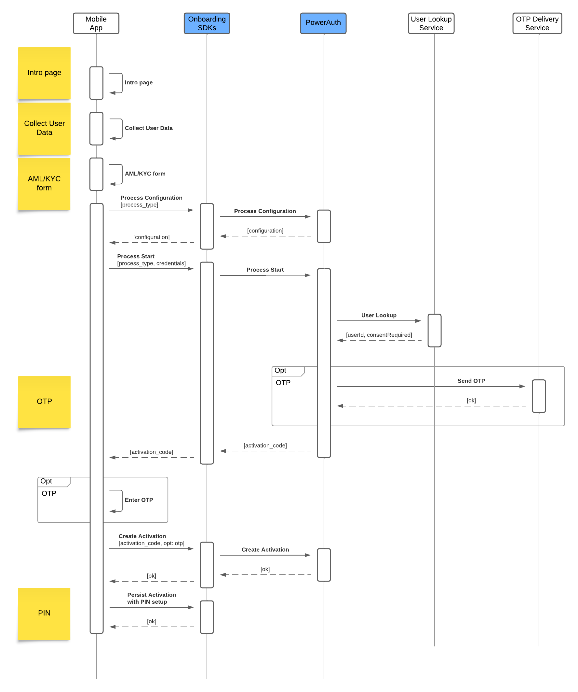
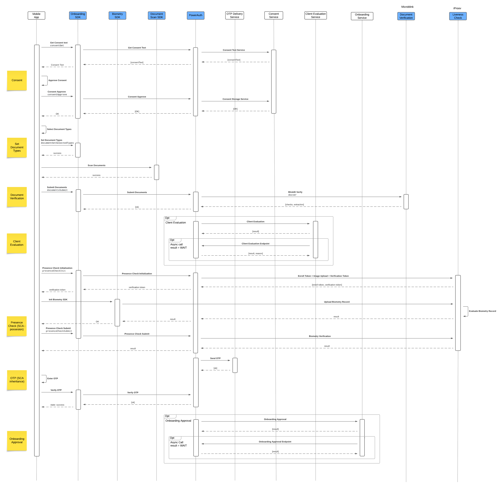

# Integration

## Identification

**1. Intro page + Collect User Data + AML/KYC form**
Described in [User Journeys](./User-Journeys.md) section.

**2. Process Configuration**
Call the SDK with with `process_type` to retrieve specific process configuration.

**3. Process Start**
Initialize onboarding process with `process_type` and user `credentials`.

The process types should be selected from the previous step.

Credentials link the user's identity to the identity in the bank. For a new user, you can use an ID from your CRM system or a username and date of birth for recovery.

The system will start the new process with a new process ID and returns `activation_code` to the SDK.

**4. User Lookup**
Semi-optional step: Calling the external [User Lookup Service](./External-Onboarding-Services.md#post-userlookup) to get user information based on the provided credentials. The service should return the user ID (temporary or final) and indicate whether the consent page is required.

There is an option to call this service later. In this case, onboarding process will use `ProcessID` as an user ID.

**5. Send OTP**
Optionally, the OTP is sent to the user by calling [OTP Delivery Service](./External-Onboarding-Services.md#post-otpsend).

**6. Enter OTP + Create Activation**
The user enters the OTP (optional) and creates a registration. The SDK will use `activation_code` returned from the Process Start.

**7. Persist Activation (with PIN setup)**
To complete device registration, the user must set up a PIN. If you plan to use temporary registration, where the initial registration will be replaced by a new one, you don't need to set up biometrics.

## Identity Verification

**Steps**

**1. Get Consent Text**
If consents are enabled, the SDK provides the text of the consent. The system must be configured with the [Consent Text Service](./External-Onboarding-Services.md#post-consenttext) on the backend. This service must be configured if the [User Lookup Service](./External-Onboarding-Services.md#post-userlookup) returns the consent as required.

**2. Approve Consent + Consent Approve**
The user approves the displayed consent, and the event propagates via the SDK to the backend. The backend marks the consent as approved and, if configured, propagates the information via the [Consent Storage Service](./External-Onboarding-Services#post-consentstorage).

**3. Set Document Types**
The user selects the document types required for verification. The SDK receives information about the selected document types.

**4. Scan Documents**
The user scans documents one by one, using the partner's BlinkID SDK to scan both sides of the document if required.

**5. Submit documents**
Documents are submitted to the backend, where they are verified against the partner API. Documents can be sent individually or in bulk.

**6. Client Evaluation**
Optionally, we can call an external [Client Evaluation Service](./External-Onboarding-Services#post-clientevaluation). The integrator can store the verification result together with the extracted data, perform its own evaluation, and return the result to continue in the process. The response can be immediate or asynchronous.

**7. Presence Check Initialization**
This step ensures the initialization of presence checks and uploads the trusted image, which is usually extracted from the document verification process. It also returns the verification token.

**8. Init Biometry SDK**
The verification token obtained in the previous step is required for use with the partner's iProov SDK. Use the SDK to complete the presence check.

**10. Presence Check Submit**
Since the iProov SDK communicates directly with the partner's backend, we need to receive confirmation that the step has been completed. Once you submit this information, we will verify result against the partner's backend and return the correct status.

**11. Onboarding Approval**
Optionally, we can call the [Onboarding Approval Service](./External-Onboarding-Services#post-clientapproval). The integrator can store information about the biometric session, perform its own evaluation, and return the result to continue in the process. The response can be immediate or asynchronous.

**12. Send OTP + Enter OTP + Verify OTP**
Although OTP usage is optional, it is required for valid strong customer authentication (SCA).

## Final Device Activation

The process is dependent how you created registration at the start.

### Flagged registration

**1.  Remove flags**
The system removes the flag `VERIFICATION_IN_PROGRESS` to identify that the device registration can be used for normal operation.

### Temporary registration

**1. Process Finish + User Lookup**
The system will finalize the process by calling [User Lookup Service](./External-Onboarding-Services.md#post-userlookup) to obtain the final user ID, in case you used a temporary or internal process user ID was used as the user identifier. This step also returns the `activation_code` to the SDK.

**2. Create Activation** 
We can create a new registration using SDK. The SDK will use `activation_code` returned from the Process Finish. At the same time, the previous temporary registration will be marked as REMOVED.

**3. Persist Activation (with PIN/Biometry setup)**
The registration process must be completed by entering the PIN and allow to use of biometry.

Following steps are common for both registration types.

**1. Process Event**
Optionally, we can call the external [Process Event Service](./External-Onboarding-Services#post-processevent).  This is the only webhook with a status of COMPLETED. We don't expect a specific response other than the standard HTTP code.

**2. Success Screen**
Described in [User Journeys](./User-Journeys.md) section.