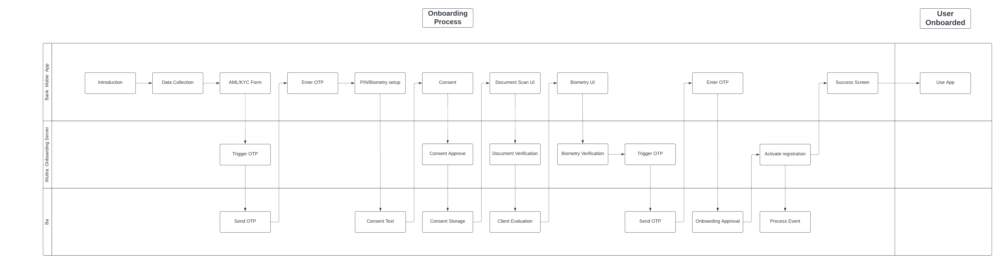
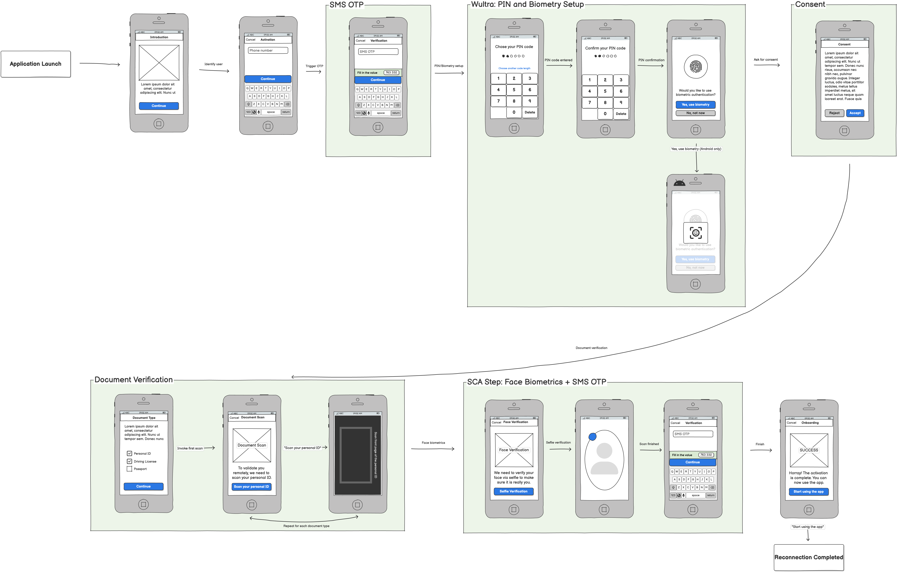
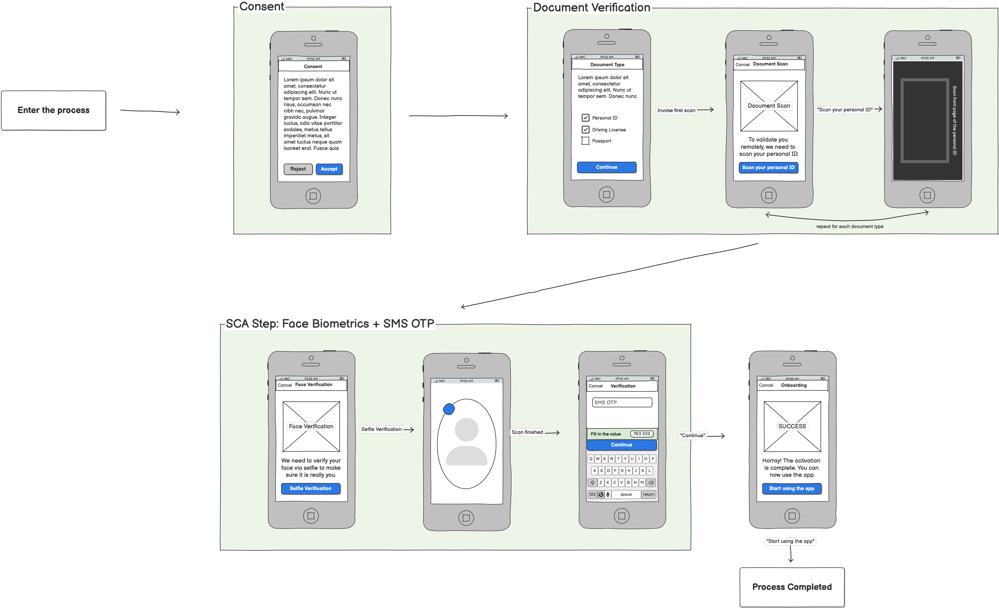

# User Journeys

## Process overview

Diagram illustrates the simplified process and its step order.

## Scenarios

The diagrams illustrate the onboarding process from the user's perspective.

<!-- begin box warning -->
For more detailed information about configuration, integration, software development kits (SDKs), and application programming interfaces (APIs), follow the specific onboarding phases with sequence diagrams.

1. [User Identification](./Integration#user-identification)
2. [Identity Verification](./Integration#identity-verification)
3. [Final Device Activation](./Integration#final-device-activation)
<!-- end -->

### New Client

This is a scenario for a new user who should be onboarded.

#### Prerequisite steps

There are initial steps that are not managed by the backend, but are required for smooth onboarding.

**The introduction page**, the first step, informs users about the service and/or the overall onboarding process.

If you want to use OTP messages, you need to **collect user data** such as phone number and/or email address. If you already have this data from marketing channels or elsewhere, you can skip this step.

Banking customers usually need to fill out an **AML/KYC form**. You can place this step anywhere in the onboarding process.

#### Onboarding steps

The core onboarding steps are managed by the backend.

Optional: The most straightforward way to identify the user is to use **SMS OTP**. This code is used for initial device registration.

To complete the device registration, the user must **set up a PIN**.

You can skip previous two steps if you don't need to identify the user, for example, in the Re-KYC flow.

Optional: The process may require user **consent**. Consents are usually required before scanning documents or biometric data.

**Document verification** starts with selecting the document type. You can configure which document types will be accepted and how many are required (e.g., two out of three documents).

The info page tells users which document type is being scanned and whether they should capture one or two sides.

The document should be scanned using the provider's BlinkID SDK. This will produce images that need to be uploaded via the Onboarding SDK.

Keep in mind that if you are scanning a document with two sides, you need to scan one side first, followed by the other. If you are scanning more than one document, which is common, you need to repeat the info page and capture process for each document.

All collected documents are sent to the back end for verification and data extraction. The extracted data contains the face image required for the presence check.

**The Presence Check** compares the live biometrics with the provided image. We typically use an image extracted from the previous step.

The face biometrics process starts with an info page where you should inform users about the process.

The face biometrics are captured by the provider's iProov SDK and the verification is processed through the partner's network. The result is then returned to the SDK. All you need to do is inform the Onboarding SDK that the step is complete so that we can continue with the process.

This step can be confirmed by a second factor using an OTP, which is required (it must be verified by the legal department) for valid Strong Customer Authentication (SCA).

There may be need to **setup PIN and confirm use of biometry** again if we have chosen onboarding process with temporary registration. If we use flagged registration, this step can be omitted.

**The success page** informs the user that the result was successful and offers the next steps.

### Reconnection

This is a scenario for a known user with a lost or new device.

### Re-KYC - expired or new documents

This is a scenario for an onboarded user with expired or new documents.

